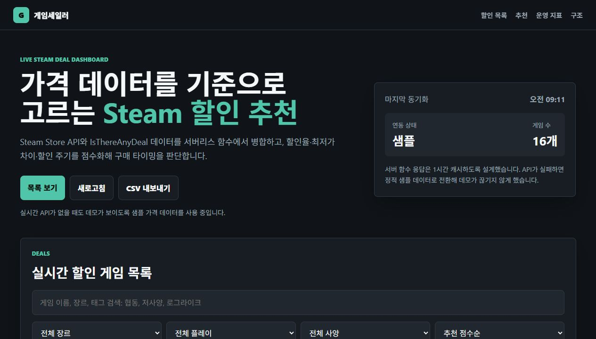

# 게임세일러

Steam 게임의 현재 할인 정보를 수집하고, 가격 이력과 구매 추천 점수로 정렬하는 포트폴리오용 웹 대시보드입니다.

## 핵심 기능

- Steam Store API 기반 현재가, 정가, 할인율, 할인 종료일 조회
- IsThereAnyDeal API 키가 있을 때 역대 최저가, 최저가 차이, 최근 가격 이력 추가
- 할인율, 최저가 차이, 할인 주기, 가격 구간을 합산한 추천 점수
- 장르, 플레이 방식, 사양, 태그, 검색어 기반 필터링
- CSV 내보내기와 샘플 데이터 fallback
- Netlify Functions 기반 서버리스 API 프록시 및 1시간 캐시

## 기술 스택

- Frontend: HTML, CSS, Vanilla JavaScript
- Backend: Netlify Functions
- External APIs: Steam Store API, IsThereAnyDeal API
- Deploy: Netlify

## 화면



## 실행

```bash
npm install
npm run dev
```

접속 주소:

```txt
http://localhost:8888
```

정적 파일만 열어도 `games.json` 샘플 데이터로 화면을 확인할 수 있습니다.

## 환경 변수

Steam 현재가만 볼 경우 환경 변수 없이 동작합니다.

```txt
ITAD_API_KEY=본인 IsThereAnyDeal API 키
ITAD_COUNTRY=KR
STEAM_COUNTRY=kr
STEAM_LANGUAGE=korean
```

## 구조

```txt
index.html                         화면 구조
style.css                          반응형 대시보드 스타일
main.js                            필터, 정렬, 추천 점수, CSV 내보내기
games.json                         샘플 게임 마스터 데이터
netlify/functions/live-games.js    Steam/ITAD API 병합 함수
netlify.toml                       Netlify 설정
package.json                       개발 스크립트
```

## 포트폴리오 포인트

이 프로젝트는 단순 목록 페이지가 아니라 외부 가격 데이터를 상품 마스터 데이터와 병합하고, 비즈니스 룰로 추천 결과를 계산하는 작은 데이터 대시보드입니다. 이커머스, ERP, 가격 정책, 상품 관리 화면으로 확장하기 좋은 구조를 의도했습니다.

ECODOOBIZ 지원용으로는 다음 역량을 강조할 수 있습니다.

- 외부 API를 서버리스 함수에서 통합하는 데이터 연동 경험
- API 실패 시 샘플 데이터로 전환하는 장애 대응
- 가격/할인/최저가를 기준으로 구매 판단 규칙을 설계한 경험
- 운영자가 확인할 수 있는 동기화 상태와 CSV export 제공

## 다음 개선 후보

- Odoo Product/Price List 형태로 데이터를 내보내는 샘플 모듈 추가
- API 요청 timeout, retry, rate-limit 방어 강화
- 추천 점수와 필터링 로직 단위 테스트 추가
- 가격 이력 차트 시각화
